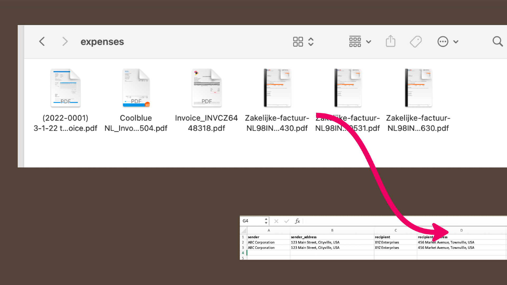

# Invoice Extractor

The Invoice Extractor is a small utility that helps you extract data from invoices in PDF format.
So you don't have to open pdf files one by one copy them etc.. 

It will output an xlsx file or csv file with sender (creditor), receipent (debtor), invoice date, total amount, tax, amount with tax etc.


So you can dump invoices in a folder and then run this when you need to send your taxes.

If you run it multiple times it will skip parsing existing files. It will parse and append new files only. 

So you can add invoices in a folder and you can run this time to time.

It can also output a csv file. 

## How it works

We read the pdf, extract the data and then send to OpenAI ChatGPT. 

## Disclaimers: 
- If you have any privacy concerns regarding ChatGPT you might want to fork this repo and connect it to your own local llm.
- This works for me, I've tried it with multiple different invoices - I keep listing my expenses like this. 
But statistically I have a very limited dataset. This means you can have issues, wrong data extracted etc. 
So might be better to double check things, especially for new invoice types.
- This software is provided "as is" without warranty of any kind. The information and functionality provided by Invoice Extractor are for general informational purposes only and should not be considered as financial, legal, or professional advice. Use the software at your own risk. The project contributors and maintainers are not responsible for any loss, damage, or harm caused by the use of this software. Always consult with a qualified professional for any financial or legal matters.

## Installation

1. Make sure you have an OpenAI account and have an API key. If not visit https://openai.com/gpt-4.
2. Export the api key 
```bash
export OPENAI_API_KEY="sk-nct...."
```
3. Make sure you have Python installed (Python 3.10 or later).
4. Install the package using pip:

```
pip install InvoiceExtractor
```

## Usage

The package provides a command-line interface (CLI) to extract data from PDF files. Here are the available commands:

### process-dir

Process all PDF files in a directory. This will output an xlsx file by default with 

```
invoice-extractor process-dir <directory_path>
```
The extracted data will be saved to a summary Excel file named summary.xls in the current directory.

#### Example
```
# Process all PDF files in a directory
invoice-extractor process-dir invoices_folder
```


### extract-pdf

Extract data from a single PDF file.
```
# Extract data from a single PDF file
invoice-extractor extract-pdf --pdf-file <path_to_pdf_file>
# example
invoice-extractor extract-pdf --pdf-file invoice.pdf
```

### Questions

Q: Does it work with only invoices in English 
- No, I use it with invoices in Dutch too, language doesn't matter

Q: Do I have to name files properly ?
- No, we don't care about file names at all. Just if you change file name, it will think it's a new invoice

Q: I took a photo of an invoice...
- Currently it doesn't work with images. I probably will integrate some ocr in future.

Q: It doesn't parse my invoice properly
- Pleaese submit an issue

Q: I use Google sheets, can you output to google sheets ?
- You can import/upload the summary.xlsx to google sheets. It works.

Q: There are other/better Saas/products 
- Yes, I'm releasing this thinking it might be helpful to some, this is not a full featured product.

### Planned Features
- Split outgoing files in credit/debit style. It puts them all together. I have expenses folder and invoiced folders and use two worksheets.
- It doesn't parse receipts/slips - eg: when you go to a restaurant, gas station. Only pdf invoices.

### Dependencies

The Invoice Extractor package depends on the following Python packages. These will be automatically installed during the package installation:

- click
- openpyxl
- openai
- langchain


## Contribute

Contributions are welcome! If you find any issues or have suggestions for improvements, feel free to open a pull request. Please make sure to follow the guidelines in the CONTRIBUTING.md file.

### License

This project is licensed under the MIT License - see the LICENSE file for details.
